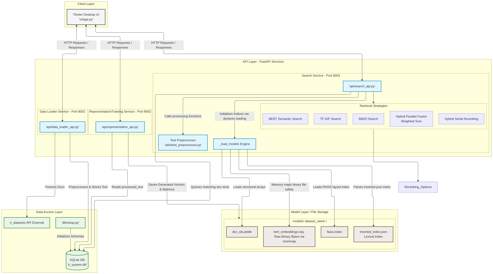
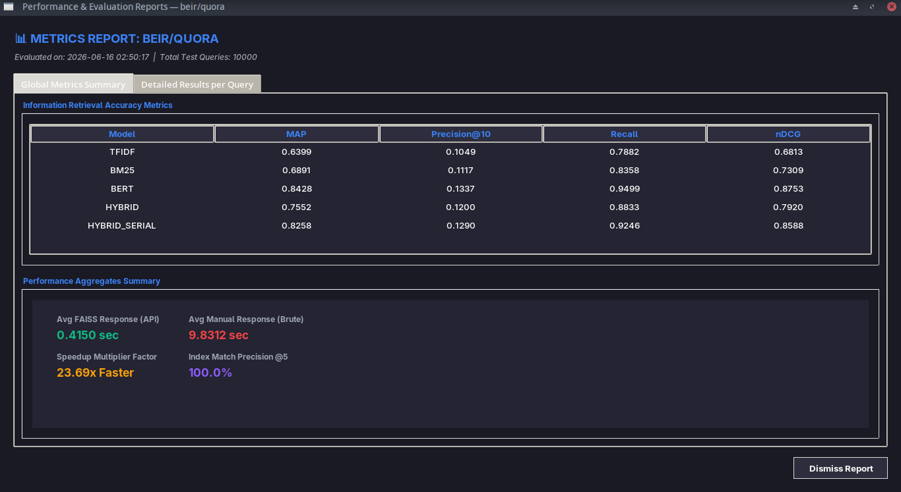
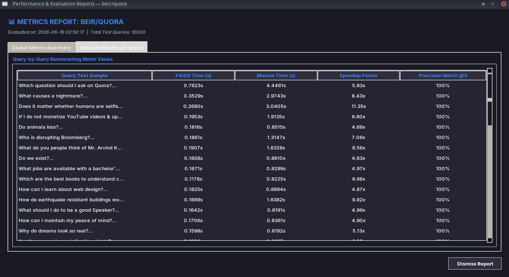

<div dir="rtl">

# قووقل Qooql

## لتشغيل المشروع اتبع الخطوات التالية:

### 1. قم بتنزيل المشروع من git

```bash
git clone https://github.com/sudoCss/qooql.git
cd qooql
```

### 2. قم بانشاء وتفعيل بيئة بايثون افتراضية باستخدام التعليمة المناسبة لنظام التشغيل

```bash
python -m venv .venv
source .venv/bin/activate # THIS IS FOR LINUX
.venv/Scripts/activate.bat # THIS IS FOR WINDOWS CMD
.venv/Scripts/Activate.ps1 # THIS IS FOR WINDOWS POWERSHELL
```

### 3. قم بتنزيل المكاتب اللازمة

```bash
pip install numpy nltk fastapi ir_datasets "setuptools<82" joblib scikit-learn rank_bm25 sentence_transformers faiss-cpu tkinter requests fastapi uvicorn pydantic tqdm pandas google-generativeai
```

### 4. قم بتهيئة قاعدة البيانات

```bash
python -m db.setup
```

### 5. قم بتشغيل الخدمات (كل خدمة في تيرمينال/CMD منفصلة)

```bash
python -m uvicorn api.data_loader_api:app --host 0.0.0.0 --port 8001
python -m uvicorn api.representation_api:app --host 0.0.0.0 --port 8002
python -m uvicorn api.search_api:app --host 0.0.0.0 --port 8003
```

ملاحظة هامة جداً: يجب في كل تيرمينال/CMD جديدة تقوم بفتحها في مجلد المشروع أن تقوم بتفعيل البيئة الافتراضية ليتم التعرف على المكاتب والمسارات

```bash
source .venv/bin/activate # THIS IS FOR LINUX
.venv/Scripts/activate.bat # THIS IS FOR WINDOWS CMD
.venv/Scripts/Activate.ps1 # THIS IS FOR WINDOWS POWERSHELL
```

### 6. قم بتشغيل الواجهة

```bash
python -m ui.app
```

### 7. في الواجهة يمكنك تنزيل الـ Datasets المتاحة وبناء تمثيلاتها المطلوبة باستخدام الأزرار

### 8. بعد التنزيل والتدريب(بناء ملفات التمثيلات المطلوبة) يمكنك اجراء عمليات البحث

### 9. قم بتشغيل عملية الاختبار واختر الـ Dataset الجاهزة عندك ليتم حساب المعايير المطلوبة عليها

```bash
python -m testing.app
```

### 10. يمكنك عرض نتائج عملية الاختبار في الواجهة باستخدام الزر المخصص

## **أولاً: ملخص تنفيذي**

تقرير فني شامل لمشروع نظام استرجاع معلومات (Information Retrieval System) متكامل، تم تصميمه وتطويره باستخدام لغة Python. يتميز النظام بتبني بنية الخدمات المنفصلة (SOA)، مما يجعله قوياً، قابلاً للتطوير، وسهل الصيانة. يهدف المشروع إلى توفير منصة فعالة للبحث في مجموعات بيانات نصية كبيرة ومتنوعة، مع تطبيق نماذج استرجاع كلاسيكية ومتقدمة، بالإضافة إلى ميزات إضافية لتحسين النتائج وتجربة المستخدم.

## **ثانياً: البنية المعمارية للنظام**

تم تصميم النظام ليكون مرناً وقابلاً للتوسع عبر تقسيم وظائفه إلى ثلاثة خدمات مستقلة وواجهة مستخدم رسومية (GUI) تتواصل مع هذه الخدمات عبر واجهات برمجية (APIs).

1. **خدمة تحميل البيانات:**
    - **المسؤولية**: استقبال طلبات تحميل ومعالجة مجموعات البيانات الأولية من واجهة المستخدم.
    - **آلية العمل**: تقرأ البيانات من المصدر (ir_datasets)، وتطبق عليها المعالجة الأولية للنصوص، ثم تخزن كلاً من النصوص الأصلية والمعالَجة في قاعدة بيانات SQLite. وقد تم تحسين هذه العملية لتتم على دفعات (Batches) لتجنب استهلاك الذاكرة المفرط والتعامل بكفاءة مع البيانات الضخمة.
2. **خدمة بناء النماذج:**
    - **المسؤولية**: بناء جميع نماذج التمثيل والفهارس اللازمة للبحث وحفظها على القرص.
    - **آلية العمل**: تقرأ النصوص المعالَجة من قاعدة البيانات وتبني النماذج والفهارس، بما في ذلك بناء فهرس FAISS.
3. **خدمة البحث:**
    - **المسؤولية**: تستقبل استعلامات المستخدم وتُرجع النتائج المرتبة.
    - **آلية العمل**: عند أول طلب، تقوم بتحميل النماذج المحفوظة مسبقاً إلى الذاكرة. ثم تنفذ البحث باستخدام النموذج المطلوب، وتعيد قائمة بالنتائج النهائية.
4. **واجهة المستخدم الرسومية GUI**:
    - **المسؤولية**: توفير واجهة رسومية (GUI) للمستخدم للقيام بعمليات البحث أو طلب تنزيل البيانات أو بناء النماذج أو عرض نتائج اختبار محرك البحث بالمعايير المطلوبة، بالإضافة لإمكانية تفعيل أو إلغاء الطلبات الإضافية وتغيير القيم للنموذج الاحتمالي.
    - **آلية العمل**: تطبيق tkinter بسيط يعرض واجهة رسومية. يقوم الكود في الواجهة بالتواصل مع خدمة البحث لإرسال الاستعلامات وعرض النتائج والاقتراحات أو مع الخدمات الأخرى بكل سهولة.

### **مخطط معمارية النظام**



## **ثالثاً: معالجة النصوص ونماذج التمثيل**

### **خط معالجة النصوص**

لضمان الدقة، يتم تطبيق نفس خطوات المعالجة على نصوص المستندات واستعلامات المستخدم. تم تحسين هذه العملية لتعتمد على Lemmatization فقط للحفاظ على المعنى الأصلي للكلمات.

### **نماذج استرجاع المعلومات المطبقة**

- #### **نموذج TF-IDF و BM25 (النماذج المعجمية)**: نماذج كلاسيكية وإحصائية قوية تعتمد على تطابق الكلمات المفتاحية ووزنها بذكاء. تم ضبط معاملات (BM25 k1=1.6, b=0.75) بشكل افتراضي لتحقيق أفضل أداء ويمكن تغييرها من الواجهة بكل سهولة.

- #### **نموذج BERT (النموذج الدلالي)**: نموذج يعتمد على الشبكات العصبية لفهم المعنى الدلالي للجمل والسياق. يتم تحويل كل مستند إلى متجه رقمي (Embedding) يمثل معناه.

- #### **النموذج الهجين (Hybrid)**: للحصول على أفضل ما في العالمين، تم دمج نتائج نموذجي BM25 و BERT
    - #### **على التفرع**: باستخدام طريقة المجموع الموزون (Weighted Sum وهي أحد الـ Fusion Methods)، التي تسمح بإعطاء وزن أكبر للنموذج الأنسب.

    - **على التسلسل**: وذلك بأخذ أفضل 100 مرشح من نموذج BM25 ثم تصفيتها وترتيبها واختيار الافضل منها باستخدام نموذج BERT.

## **رابعاً: الميزات المتقدمة (الطلبات الإضافية)**

### **تخزين المتجهات (Vector Store) باستخدام FAISS**

عند استخدام نموذج BERT، ينتج لدينا مئات الآلاف أو ملايين المتجهات (Vectors). البحث فيها بشكل تسلسلي لمقارنة استعلام جديد مع كل متجه على حدة هو عملية بطيئة جداً وغير عملية. لحل هذه المشكلة، يوفر النظام امكانية تفعيل البحث بالاستفادة من Vector Store وتحديدا ( Facebook AI Similarity Search aka FAISS): وهي مكتبة برمجية عالية الكفاءة من Meta، متخصصة في البحث عن التشابه السريع في مجموعات ضخمة من المتجهات.

يقوم FAISS بتنظيم هذه المتجهات في بنية بيانات ذكية ومضغوطة (مثل الأشجار أو العناقيد). عند وصول استعلام جديد، يتنقل FAISS بذكاء عبر هذه البنية ليجد "أقرب الجيران" (أي المستندات الأكثر تشابهاً) في وقت قياسي، دون الحاجة للمرور على كل المتجهات.

يتم ضغط وتخزين هذه البنية الذكية بأكملها في ملف ثنائي واحد محسن للغاية هو faiss.index. هذا التصميم يجعل تحميل الفهرس والبحث فيه فائق السرعة.

## **خامساً: توصيف الـ Dataset المستخدمة (beir/quora)**

### هذه المجموعة مأخوذة من موقع Quora الشهير للأسئلة والأجوبة. ولكن، المهمة هنا مختلفة. كل "مستند" هو في الحقيقة سؤال.

### الهدف الأساسي لهذه المجموعة هو تحديد الأسئلة المكررة (Duplicate Question Detection). لكل استعلام (وهو أيضاً سؤال)، يجب على النظام أن يجد جميع الأسئلة الأخرى في المجموعة التي تسأل عن نفس الشيء، حتى لو كانت بصياغة مختلفة تماماً. فالاستعلامات هي دائماً أسئلة. أنت تبحث عن أسئلة مشابهة لسؤالك.

### ويتم التقييم باستخدام قسم \`beir/quora/test\`. ملف \`qrels\` الخاص به يحدد لكل سؤال، ما هي الأسئلة الأخرى التي تعتبر "مكررة" له.

### **أمثلة على الاستعلامات الملائمة:**

- ## \`How can I learn to code?\` (سيقوم النظام بالبحث عن أسئلة أخرى مثل: "What is the best way to start programming?", "Where should a beginner start with coding?")

- ## \`What are the health benefits of meditation?\`

- ## \`How can I travel on a budget?\`

## **سادساً: تحليل النتائج**

لا يوجد نموذج واحد هو الأفضل دائماً، فأداء النموذج يعتمد بشكل كلي على طبيعة البيانات والمهمة.

بعد إجراء الاختبارات المطلوبة تم التوصل إلى النتائج التالية:



يقوم نظامنا بشكل أساسي بناء على مجموعة البيانات beir/quora(تحديد الاسئلة المتكررة) والتي تكون طبيعة الصلة فيها دلالية Semantic وتعتمد على تشابه المعنى لذلك نجد أن نموذج BERT حقق انتصاراً ساحقاً كنموذج منفرد لأنه مصمم لفهم المعنى وتجاهل الفروقات السطحية بين الكلمات، وحتى في السياق الهجين نجد أنه سبب تراجعاً في الأداء بسبب تأثر نموذج BERT بالضجيج الذي قد ينتجه نموذج BM25.

وبالنسبة لاسختدام الـ Vector Store فقد تبين أنه زاد سرعة النظام بحوالي 24 مرة، وهنا بعض النماذج من عملية الاختبار تبين الفرق في السرعة بدون ومع الاستفادة من FAISS:



حيث نلاحظ أنه في كل المرات يمكننا FAISS من تحقيق سرعة أعلى بكثير.

## **سابعاً: الخلاصة والتوصيات**

نجحنا في هذا المشروع في بناء نظام استرجاع معلومات قوي، مرن، وغني بالميزات. التصميم القائم على بنية الخدمات المنفصلة (SOA) يضمن قابلية التوسع والصيانة المستقبلية.

### **أهم الاستنتاجات:**

- **قوة البنية المعمارية**: أثبتت بنية SOA فعاليتها في تقسيم المهام المعقدة وإدارة الموارد بكفاءة.
- **أهمية النموذج الهجين**: استراتيجية الدمج الذكية (مثل المجموع الموزون) يمكن أن تتفوق على أي نموذج فردي ولكن يجب الأخذ بعين الاعتبار في نفس الوقت مدى تأثر النموذج المتفوق فردياً بالنموذج الآخر الأقل تفوقاً وهل ستكون نتيجة الدمج أفضل من النتيجة الفردية بالضرورة أم أن الدمج سيؤثر سلباً؟.
- **التجميع الدلالي يعزز الدقة**: استخدام عناقيد BERT يوفر نتائج أكثر اتساقاً من الناحية الموضوعية.
- **لا حل واحد يناسب الجميع**: يجب اختيار نموذج الاسترجاع وتقنيات التحسين بناءً على طبيعة البيانات والمهمة المحددة.
